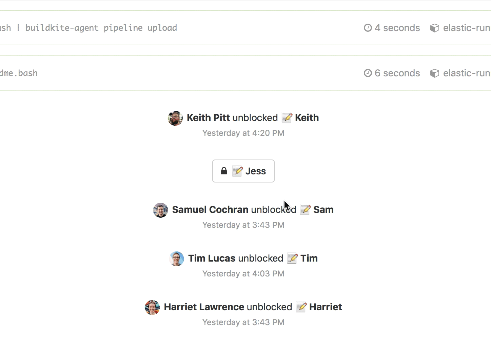
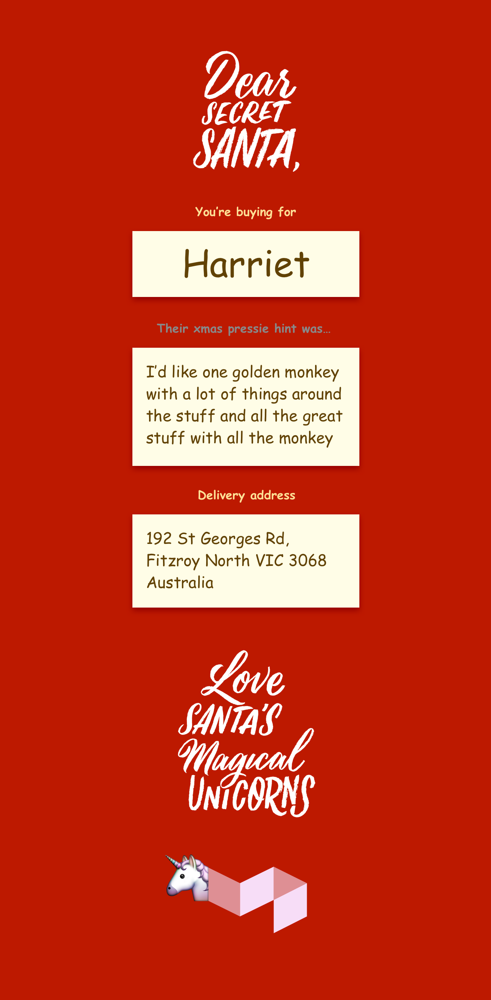

<h1></h1>

[Buildkite](https://buildkite.com/)’s Secret Santa 2016 build pipeline, to find out xmas pressie hints from everyone, and notify each of us with who we’re buying for and what their hint was.

## How does it work?

The build pipeline:

* [pipeline/pipeline.bash](pipeline/pipeline.bash) - generates the Buildkite pipeline that requests Secret Santa hints from everyone.
* [pipeline/readme.bash](pipeline/readme.bash) - the first step in the pipeline that welcomes everyone to this year’s Secret Santa.
* [pipeline/magical-unicorns.bash](pipeline/magical-unicorns.bash) - the last step in the pipeline: a brilliantly red magical unicorn.

The webhook receiver:

* [notifier/index.js](notifier/index.js) - the AWS Lambda function that accepts the `job.finished` webhook from Buildkite, randomly assigns secret santas, and emails everyone with the hint and delivery address.
* [notifier/job-event-processor.js](notifier/index.js) - extracts the information submitted by everyone from the webhook’s build meta-data.
* [notifier/secret-santa.js](notifier/index.js) - randomly assigns each secret santa based on a determistic seed value for safe re-execution. The seed is read from an environment variable so it can be changed at the last minute, to keep the "secret" in "Secret Santa".

## Give it a try

## Thanks

Massive props to the brilliant [Carla Hackett](http://carlahackett.com/) for the beaut lettering 👌

## Screenshots

## License

See [Licence.md](Licence.md) (MIT)
